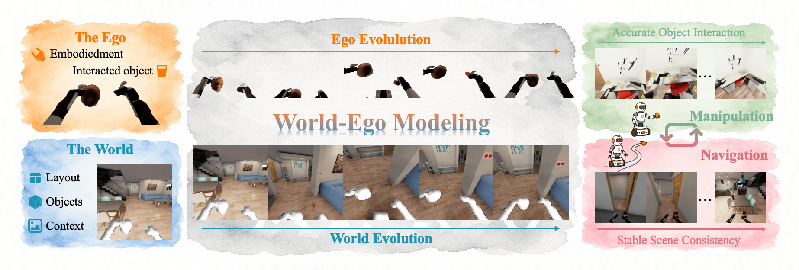

# World-Ego Modeling for Long-Horizon Evolution in Hybrid Embodied Tasks

**Zuyao Lin**<sup>1,2,3</sup>, **Jianhui Zhang**<sup>3,4</sup>, **Peidong Jia**<sup>5</sup>, **Xiaoguang Zhao**<sup>1</sup>, **Shanghang Zhang**<sup>5</sup>, **Xingyu Chen**<sup>3,✉</sup>

<sup>1</sup>Institute of Automation, Chinese Academy of Sciences  
<sup>2</sup>University of Chinese Academy of Sciences  
<sup>3</sup>Zhongguancun Academy  
<sup>4</sup>Shanghai Jiaotong University  
<sup>5</sup>Peking University

<sup>✉</sup>Corresponding author

[](https://arxiv.org/abs/2605.19957)
[](https://zgca-hmi-lab.github.io/WEM/)
[](https://huggingface.co/Zoorao/WEM)
[](https://huggingface.co/datasets/Zoorao/HTEWorld)

---



---

## Abstract

World models are widely explored in embodied intelligence, yet they typically predict world and ego evolution within a single stream, entangling persistent instruction-agnostic scene regularities with robot-centric instruction-conditioned dynamics. This entanglement degrades performance in long-horizon scenarios, particularly in hybrid tasks with interleaved navigation and manipulation. We introduce **World-Ego Modeling**, a paradigm that decomposes future evolution into separate world and ego components, defined from motion-, semantic-, and intention-based perspectives. We instantiate this as the **World-Ego Model (WEM)**, coupling an implicit world-ego planner with a cascade-parallel mixture-of-experts (CP-MoE) diffusion generator. To enable rigorous evaluation, we construct **HTEWorld**, the first benchmark for long-horizon world modeling with hybrid tasks, providing about 125K video clips (4.5M+ frames) with fine-grained action annotations and 300 multi-turn trajectories (2K+ instructions). WEM achieves state-of-the-art performance on HTEWorld while remaining competitive on existing manipulation-only benchmarks.

---

## ⚙️ Installation

```bash
conda create -n wem python=3.10 -y
conda activate wem
pip install -r requirements.txt
```

Download the required model checkpoints:

```bash
# Wan2.2-TI2V-5B (video decoder backbone)
huggingface-cli download Wan-AI/Wan2.2-TI2V-5B \
    --local-dir checkpoints/Wan2.2-TI2V-5B

# Qwen3-VL-2B-Instruct (world model backbone)
huggingface-cli download Qwen/Qwen3-VL-2B-Instruct \
    --local-dir checkpoints/Qwen3-VL-2B-Instruct
```

---

## 📦 Data Preparation

Download HTEWorld from Hugging Face:

```bash
huggingface-cli download Zoorao/HTEWorld \
    --repo-type dataset \
    --local-dir <HTEWORLD_ROOT>
```

The dataset repository contains two splits:

```
<HTEWORLD_ROOT>/
├── train/
│   ├── task-0000.tar.gz
│   ├── task-0001.tar.gz
│   ├── ...
│   └── task-0010.tar.gz
└── eval/
    ├── task_001/
    │   ├── first_frame.jpg
    │   ├── video.mp4
    │   ├── prompts.txt
    │   └── prompt_nav_manip.txt
    └── ...
```

The `train/` split contains WEM training annotations only. It does not include raw BEHAVIOR-1K training videos. Download the corresponding BEHAVIOR-1K videos separately, then preprocess them into the WEM training layout:

```bash
python tools/prepare_b1k.py \
    --root_dir <BEHAVIOR_1K_ROOT> \
    --output_dir <DATA_ROOT>/train \
    --task_name all
```

Extract the released annotation archives and merge them into the processed video directory:

```bash
mkdir -p <ANNOTATION_ROOT>

for archive in <HTEWORLD_ROOT>/train/task-*.tar.gz; do
    tar -xzf "$archive" -C <ANNOTATION_ROOT>
done

rsync -a <ANNOTATION_ROOT>/ <DATA_ROOT>/train/
```

The released annotations cover `task-0000` to `task-0008` and `task-0010`. The first five episodes of each task are excluded from training, and empty clips without complete annotations are omitted.

Expected training layout:

```
<DATA_ROOT>/train/
├── task-0000/
│   ├── episode_000/
│   │   ├── first_frame.jpg
│   │   ├── clip_0/
│   │   │   ├── video.mp4
│   │   │   ├── caption.txt
│   │   │   └── mask.npz
│   │   └── ...
│   └── ...
└── ...
```

The `eval/` split is already in the benchmark format and does not require preprocessing.

Pre-compute the cached tensors used during training:

**VAE latents**

```bash
python tools/precompute_latents.py \
    --data_root <DATA_ROOT>/train \
    --vae_pth checkpoints/Wan2.2-TI2V-5B/Wan2.2_VAE.pth
```

**T5 text embeddings**

```bash
python tools/precompute_text_embeds.py \
    --data_root <DATA_ROOT>/train \
    --t5_pth checkpoints/Wan2.2-TI2V-5B/models_t5_umt5-xxl-enc-bf16.pth \
    --tokenizer_path checkpoints/Wan2.2-TI2V-5B/google/umt5-xxl
```

**Qwen3-VL visual embeddings**

```bash
python tools/precompute_visual_embeds.py \
    --data_root <DATA_ROOT>/train \
    --model_path checkpoints/Qwen3-VL-2B-Instruct
```

**Qwen3-VL token IDs**

```bash
python tools/precompute_text_ids.py \
    --data_root <DATA_ROOT>/train \
    --model_path checkpoints/Qwen3-VL-2B-Instruct
```

---

## 🏗️ Training

Training follows two stages. Stage 1 pre-trains the video decoder; Stage 2 adds the world model and trains the full WEM.

This repository recommends launching training directly with `train.py`. The shell scripts under `scripts/` are only legacy wrappers and may hide important arguments.

**Stage 1 — decoder pre-training:**

```bash
torchrun --standalone --nnodes=1 --nproc_per_node=<NUM_GPUS> train.py \
    --stage 1 \
    --dataset b1k \
    --data_root <DATA_ROOT>/train \
    --ckpt_path <WAN2.2_CHECKPOINT_DIR> \
    --output_dir <OUTPUT_DIR>
```

**Stage 2 — full WEM training:**

```bash
torchrun --standalone --nnodes=1 --nproc_per_node=<NUM_GPUS> train.py \
    --stage 2 \
    --dataset b1k \
    --data_root <DATA_ROOT>/train \
    --ckpt_path <WAN2.2_CHECKPOINT_DIR> \
    --decoder_ckpt_path <STAGE1_CHECKPOINT_DIR> \
    --qwen_model_path <QWEN3_VL_CHECKPOINT_DIR> \
    --finetune \
    --output_dir <OUTPUT_DIR>
```

Additional hyperparameters such as learning rate, batch size, precision, FSDP mode, and checkpoint interval can be passed directly to `train.py`. Run `python train.py --help` for the full argument list. With `--fsdp_sharding hybrid`, launch one process per visible GPU on the node.

---

## 📊 Evaluation

### Video Generation

First download the released WEM checkpoint from Hugging Face:

```bash
huggingface-cli download Zoorao/WEM \
    --local-dir <WEM_CHECKPOINT_ROOT>
```

The released weights are sharded under `<WEM_CHECKPOINT_ROOT>/checkpoint`. EMA weights are available under `<WEM_CHECKPOINT_ROOT>/checkpoint_ema`.

Generate a single video from a first frame and a sequence of instructions:

```bash
python generate.py \
    --ckpt_dir <WEM_CHECKPOINT_ROOT>/checkpoint \
    --wan_ckpt_dir <WAN2.2_CHECKPOINT_DIR> \
    --qwen_ckpt_dir <QWEN3_VL_CHECKPOINT_DIR> \
    --image <FIRST_FRAME_IMAGE> \
    --instructions \
        "<INSTRUCTION_1>" \
        "<INSTRUCTION_2>" \
        "<INSTRUCTION_3>" \
    --output <OUTPUT_MP4>
```

By default, all provided instructions are used. Backbone checkpoints can be configured with `--wan_ckpt_dir` and `--qwen_ckpt_dir`.

### HTEWorld Benchmark

HTEWorld evaluation reports six formal metrics: RCBD, LPSA, CISR, PMPA, CPDM, and FPHSC.

The `eval/` split in `Zoorao/HTEWorld` contains all files required for benchmark evaluation, including the complete ground-truth video for each task:

```
<HTEWORLD_ROOT>/eval/
├── task_000/
│   ├── first_frame.jpg
│   ├── video.mp4
│   ├── prompts.txt
│   ├── prompt_nav_manip.txt
│   └── ...
├── task_001/
│   └── ...
└── ...
```

`prompts.txt` contains the generation instructions. `prompt_nav_manip.txt` contains the navigation/manipulation phase labels used by the evaluator.

Generate benchmark predictions:

```bash
python generate.py \
    --ckpt_dir <WEM_CHECKPOINT_ROOT>/checkpoint \
    --wan_ckpt_dir <WAN2.2_CHECKPOINT_DIR> \
    --qwen_ckpt_dir <QWEN3_VL_CHECKPOINT_DIR> \
    --benchmark_root <HTEWORLD_ROOT>/eval \
    --output_dir <PREDICTION_ROOT>
```

The command saves predictions as:

```
<PREDICTION_ROOT>/
├── task_000/
│   └── 0.mp4
├── task_001/
│   └── 0.mp4
└── ...
```

Compute the six HTEWorld metrics:

```bash
python eval/evaluate.py \
    --output-root <PREDICTION_ROOT> \
    --benchmark-root <HTEWORLD_ROOT>/eval \
    --save-dir <EVAL_SAVE_DIR> \
    --metrics formal \
    --model-name <MODEL_NAME>
```

Results are saved under:

```
<EVAL_SAVE_DIR>/<MODEL_NAME>/
```

---

## 📜 License

This project is licensed under the [Creative Commons Attribution-NonCommercial 4.0 International License](LICENSE).

---

## 🙏 Acknowledgements

We thank the authors of [Wan2.2](https://github.com/Wan-Video/Wan2.2) for the video generation backbone.

---

## 📖 Citation

```bibtex
@article{wem2026,
  title={World-Ego Modeling for Long-Horizon Evolution in Hybrid Embodied Tasks},
  author={Lin, Zuyao and Zhang, Jianhui and Jia, Peidong and Zhao, Xiaoguang and Zhang, Shanghang and Chen, Xingyu},
  journal={arXiv preprint arXiv:2605.19957},
  year={2026}
}
```
